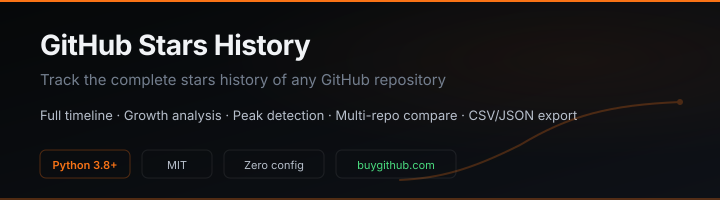

<p align="center">
  
</p>

<p align="center">
  <a href="https://github.com/Marcos66236/github-star-history/stargazers"></a>
  <a href="https://github.com/Marcos66236/github-star-history/network/members"></a>
  <a href="https://github.com/Marcos66236/github-star-history/blob/main/LICENSE"></a>
  <a href="https://www.python.org/"></a>
</p>

<p align="center">
  Track the complete star history of any GitHub repository.<br>
  Growth patterns, trending velocity, multi-repo comparison, CSV and JSON export.
</p>

<p align="center">
  <a href="https://buygithub.com/?utm_source=github&utm_medium=readme&utm_campaign=github-star-history"><b>buygithub.com</b></a> · <a href="https://buygithub.com/blog/how-github-stars-work/">How GitHub Stars Work</a> · <a href="https://t.me/AlpinTamhas928">Telegram</a>
</p>

---

<p align="center">
  <a href="https://t.me/AlpinTamhas928"></a>
</p>

<p align="center"><b>Sponsorship &amp; contact:</b> ranking projects in the <b>top 1-5 GitHub search results</b> — <a href="https://t.me/AlpinTamhas928">message me on Telegram</a> to get yours there.</p>

---

## Why star history matters

Stars are not vanity. GitHub uses star velocity as a core signal for its **Trending** page, **Explore** feed, and **search ranking**. A repository gaining 200 stars in 24 hours is more likely to surface than one with 10,000 total stars but flat recent growth.

This tool gives you the raw data: when each star was given, by whom, and at what rate. Compare your project against competitors, track your own growth week by week, and understand the velocity patterns that drive GitHub discovery.

For the full mechanics behind GitHub's algorithms, see [how GitHub stars actually work](https://buygithub.com/blog/how-github-stars-work/).

## Features

| Feature | Description |
|---------|-------------|
| **Full history** | Every star with exact timestamp, from the first to the latest |
| **Growth analysis** | Daily, weekly, monthly, yearly growth rates |
| **Peak detection** | Identifies the single best day and the velocity around it |
| **Multi-repo compare** | Pass multiple repos and compare growth patterns |
| **Export** | CSV and JSON output for analysis or visualization |
| **Rate-limit aware** | Automatic retry with backoff on GitHub API limits |
| **Token support** | Optional GitHub token for 5,000 req/hour instead of 60 |

## Quick start

```bash
git clone https://github.com/Marcos66236/github-star-history.git
cd github-star-history
pip install requests
python star_history.py torvalds/linux
```

## Usage

### Single repository

```bash
python star_history.py facebook/react
```

```
Fetching star history for facebook/react...
  Total: 231,847 stars

Repository: facebook/react
Total stars: 231,847
Created: 2013-05-24
Age: 13 years, 3 months

Growth summary:
  Last 7 days:    +287 stars (41.0/day)
  Last 30 days:   +1,043 stars (34.8/day)
  Last 365 days:  +11,294 stars (30.9/day)
  All time:       +231,847 stars (47.8/day)

Peak day: 2023-10-05 (+2,341 stars)

Exported to facebook_react_stars.csv
```

### Compare multiple repositories

```bash
python star_history.py facebook/react vuejs/vue sveltejs/svelte angular/angular
```

Outputs a separate analysis for each repository. Compare growth rates, peak days, and velocity side by side.

### Export formats

```bash
# CSV with user and timestamp per star (default)
python star_history.py owner/repo --format csv

# JSON with full analysis and metadata
python star_history.py owner/repo --format json

# Summary only, no file export
python star_history.py owner/repo --summary
```

### Using a GitHub token

Without a token, the GitHub API allows 60 requests per hour. For repositories with thousands of stars, set a token:

```bash
export GITHUB_TOKEN=ghp_your_token_here
python star_history.py torvalds/linux
```

Generate a token at [github.com/settings/tokens](https://github.com/settings/tokens). No special scopes needed for public repositories.

## How it works

The GitHub API endpoint:

```
GET /repos/{owner}/{repo}/stargazers
Accept: application/vnd.github.star+json
```

Returns each star event with a timestamp. The tool paginates through the full history at 100 entries per request, handles rate limits with automatic backoff, and reconstructs the complete growth timeline.

**Star velocity** is one of the primary signals GitHub uses for Trending. A new project gaining 50 stars in a day has higher relative velocity than a mature project with 50,000 stars gaining 100. The Trending page surfaces repositories with unusual acceleration in their star rate, not just high totals.

## Sample output

See [`sample-output.json`](sample-output.json) for a complete JSON output example.

```json
{
  "repository": "facebook/react",
  "summary": {
    "total": 231847,
    "avg_per_day": 47.8,
    "last_30_days": 1043,
    "peak_day": "2023-10-05",
    "peak_count": 2341
  }
}
```

## Requirements

- Python 3.8+
- `requests` (`pip install requests`)
- Optional: GitHub personal access token

## Contributing

See [CONTRIBUTING.md](CONTRIBUTING.md) for guidelines.

## License

MIT License. See [LICENSE](LICENSE) for details.

---

<p align="center">
  <b>Seen by the people who matter.</b><br>
  <i>Top 1-5 GitHub search placement for your keywords, done quietly and properly.</i>
</p>

<p align="center">
  🔍 <b>Right audience</b> &nbsp;·&nbsp; 📈 <b>Steady growth</b> &nbsp;·&nbsp; 💸 <b>Budget-friendly</b>
</p>

<p align="center">
  <a href="https://t.me/AlpinTamhas928"></a><br>
  <i>Contact me on Telegram for the package — small budgets, real results</i>
</p>
